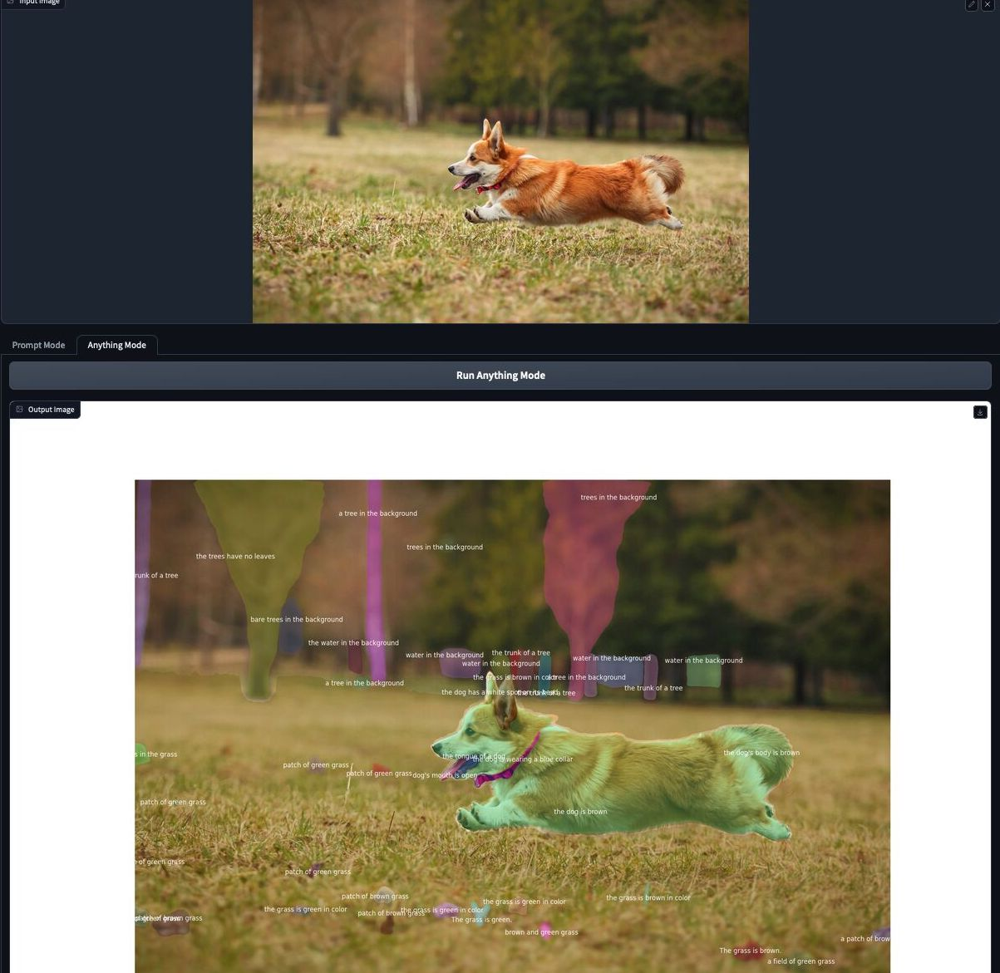
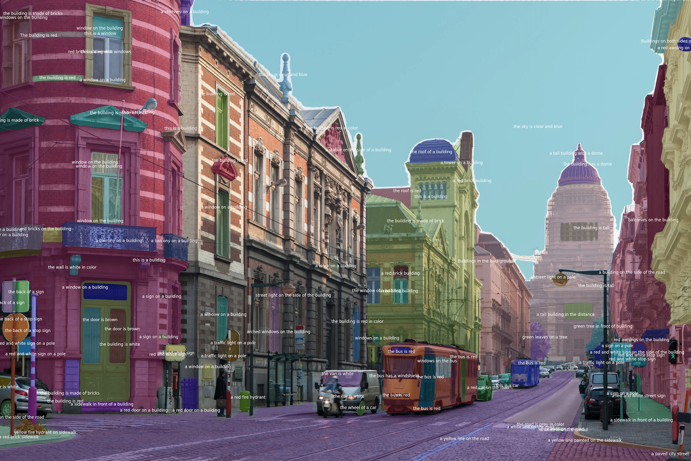

## Gradio App

We provide a gradio demo for SCA with both "prompt mode" and "anything mode".

<table>
  <tr>
    <td></td>
    <td></td>
  </tr>
</table>

Gallary of anything mode:

<table>
  <tr>
    <td></td>
    <td></td>
  </tr>
  <tr>
    <td></td>
    <td></td>
  </tr>
</table>

```shell
CKPT_PATH=
python scripts/apps/sca_app.py \
+model=base_sca_multitask_v2 \
model.model_name_or_path=$CKPT_PATH \
model.lm_head_model_name_or_path=$(python scripts/tools/get_sub_model_name_from_ckpt.py $CKPT_PATH "lm")
```


We also provide an app to visualize the dataset:

```shell
python scripts/apps/dataset_viewer_app.py \
train_data='[vg-densecap-local]' \
eval_data='[vg-densecap-local]' \
+model=base_sca_multitask_v2 \
training.do_train=True \
training.do_eval=True \

# View original datasets
python scripts/apps/dataset_viewer_app.py \
train_data='[vg-densecap-local]' \
eval_data='[vg-densecap-local]' \
+model=base_sca_multitask_v2 \
training.do_train=False \
training.do_eval=False
```